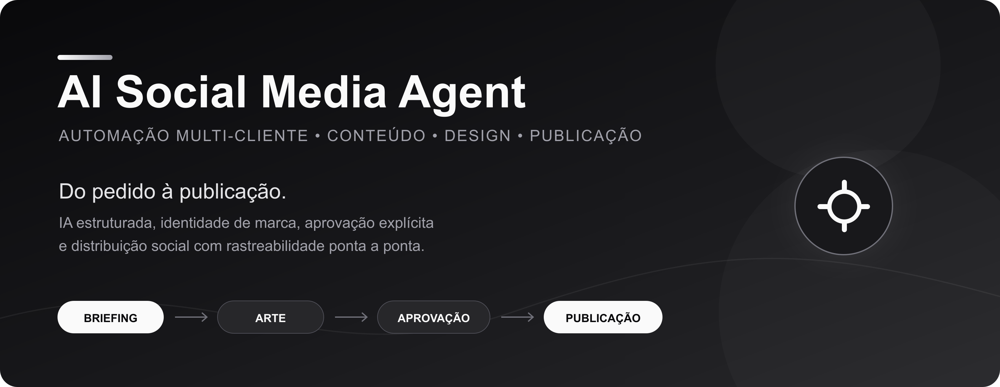
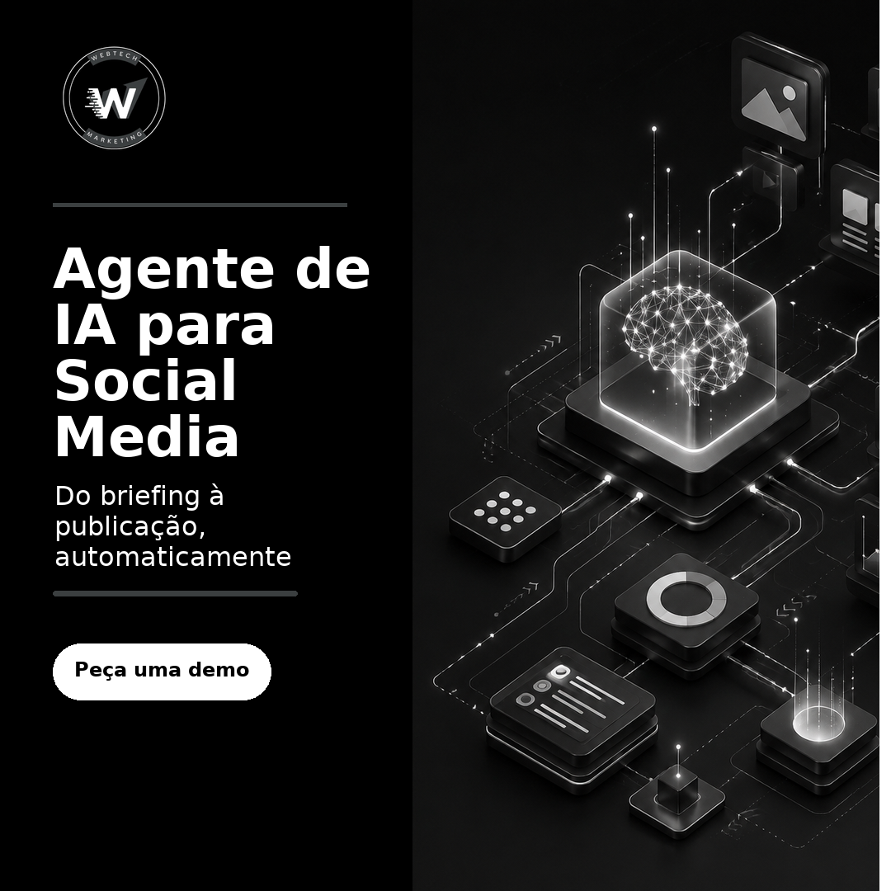
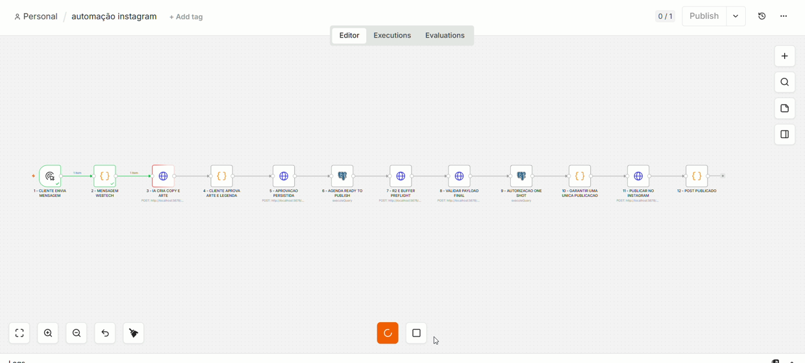
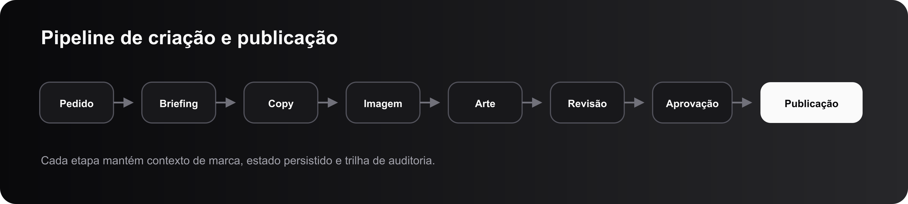
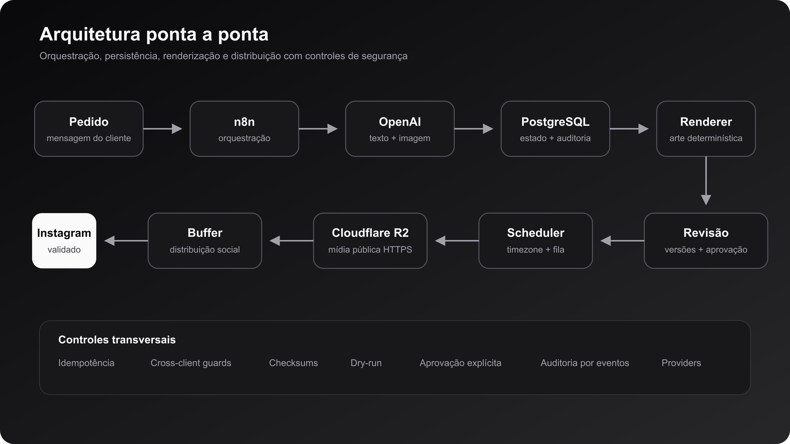
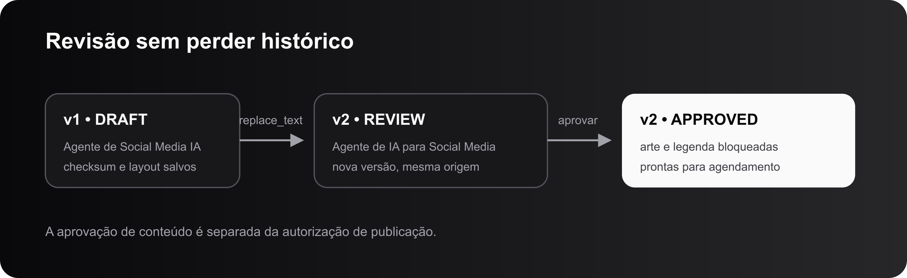

<div align="center">

# AI Social Media Agent

**Do pedido à publicação: automação de Social Media com IA.**

[](https://www.python.org/)
[](https://n8n.io/)
[](https://www.postgresql.org/)
[](https://www.docker.com/)
[](https://fastapi.tiangolo.com/)
[](https://openai.com/)

</div>



> Uma automação multi-cliente para criação, revisão, aprovação, agendamento e distribuição de conteúdo com IA — com identidade de marca e rastreabilidade em cada etapa.

## Sobre o projeto

O **AI Social Media Agent** automatiza o fluxo de Social Media desde a mensagem inicial até a publicação. O sistema identifica o cliente, carrega sua identidade visual e suas regras, interpreta a intenção, gera conteúdo estruturado, produz a imagem, monta a arte e mantém o processo de revisão, aprovação e agendamento sob controle.

O projeto combina a flexibilidade do n8n com serviços Python especializados. PostgreSQL concentra estado e auditoria; o renderer local transforma um `layout_spec` versionado em uma arte reproduzível; Cloudflare R2 disponibiliza a mídia aprovada; e Buffer faz a distribuição ao canal configurado.

> **Status:** projeto funcional em evolução, com fluxo de publicação no Instagram validado em execução real via Buffer.

## Demo WebTech

A WebTech é a marca de demonstração da versão pública. Seu perfil define paleta, logo, regras visuais, segmento, timezone e template próprios.

| Arte final renderizada | Orquestração real no n8n |
|---|---|
|  |  |

O exemplo acima percorre o fluxo com a headline **“Agente de IA para Social Media”**, imagem gerada, composição determinística e aprovação versionada. O vídeo demonstrativo completo será adicionado quando houver uma URL pública apropriada.

## Como funciona



1. A mensagem é recebida e persistida com um identificador de correlação.
2. O cliente é identificado e o perfil da marca é carregado do PostgreSQL.
3. O provider de IA retorna briefing, copy, legenda, hashtags e prompt visual em saída estruturada.
4. A imagem é gerada e o renderer aplica template, logo, paleta, tipografia e regras de layout.
5. Pedidos de alteração criam novas versões; a aprovação bloqueia arte e legenda.
6. O scheduler resolve timezone, plataforma e fila de publicação.
7. A mídia aprovada é enviada ao R2 e distribuída pelo Buffer ao Instagram.

## Funcionalidades

### Conteúdo

- identificação de cliente e interpretação de intenção;
- briefing, headline, subtítulo, CTA, legenda e hashtags estruturados;
- prompt visual e geração de imagem por provider intercambiável;
- persistência do conteúdo, respostas, arte e metadados de geração.

### Identidade visual

- perfis e templates por cliente;
- logo, paleta, tipografia e regras de marca;
- renderer determinístico com safe areas e word wrapping;
- redução automática de fonte, auto-layout e detecção de colisões;
- `layout_spec` persistido para reprodução e revisão.

### Workflow

- revisão, versionamento e aprovação explícita;
- calendário editorial e agendamento;
- timezone e resolução de plataforma por cliente;
- fila de publicação, retries e eventos de auditoria.

### Publicação

- armazenamento de mídia no Cloudflare R2;
- integração com Buffer GraphQL API;
- fluxo real validado no Instagram;
- abstrações de provider para evolução de canais.

## Arquitetura



Os workflows coordenam serviços pequenos e especializados. A comunicação usa IDs de correlação, enquanto PostgreSQL registra mudanças de estado e eventos. O renderer e o serviço de publicação permanecem separados para que aprovação de conteúdo nunca equivalha, por si só, a autorização para publicar.

Detalhes técnicos: [arquitetura](docs/architecture.md) e [segurança](docs/security.md).

## Aprovação e versionamento



Cada revisão preserva a versão anterior, gera um novo checksum e registra a alteração aplicada. Apenas a versão aprovada pode seguir para o agendamento; a publicação ainda depende de guards adicionais de ambiente e canal.

## Stack

| Tecnologia | Uso |
|---|---|
| n8n | Orquestração dos workflows |
| Python | Serviços, renderer e automações |
| FastAPI | APIs internas de renderização, mídia e publicação |
| Pillow | Renderer determinístico de artes |
| PostgreSQL | Persistência, estados, calendário e auditoria |
| Docker Compose | Ambiente local reproduzível |
| OpenAI | Conteúdo estruturado e geração de imagem |
| Cloudflare R2 | Armazenamento de mídia aprovada |
| Buffer GraphQL API | Distribuição social |

## Arquitetura multi-cliente

Cada cliente pode ter configurações isoladas de:

- perfil e regras de marca;
- identidade visual, templates e assets;
- timezone e calendário editorial;
- contas e plataformas sociais;
- conteúdos, versões, aprovações e jobs de publicação.

As consultas e mutations críticas validam a associação entre cliente, conteúdo, versão e conta social para reduzir o risco de cruzamento de dados.

## Segurança e confiabilidade

- secrets ficam fora do Git e entram apenas por variáveis de ambiente;
- `mock` e `dry-run` são os padrões seguros da configuração pública;
- checksums vinculam arquivo renderizado, versão e publicação;
- chaves de idempotência evitam criação ou publicação duplicada;
- aprovação de conteúdo e autorização de publicação são estados separados;
- guards cross-client validam a posse dos recursos;
- eventos registram decisões e transições relevantes;
- retries limitados tratam falhas transitórias sem ocultar estados incertos.

## Testes

A suíte pública inclui smoke tests do renderer, validação dos JSONs de workflow e asserts das travas de publicação. Execute:

```bash
python -m unittest discover -s tests -p "test_*.py" -v
```

Durante o desenvolvimento, o fluxo também foi validado em cenários de word wrapping, colisão, versionamento, aprovação, scheduler, timezone, idempotência, isolamento entre clientes, upload R2, Buffer dry-run e guards de publicação. Nenhuma chamada externa é necessária para executar os testes públicos.

## Executando localmente

### Pré-requisitos

- Docker Desktop com Docker Compose;
- Git;
- chaves externas somente se você decidir sair do modo mock.

```bash
git clone https://github.com/giulia05tomaz/social-media-ai-agent.git
cd social-media-ai-agent
cp .env.example .env
```

Preencha no `.env` as credenciais locais do PostgreSQL e as chaves internas obrigatórias. Mantenha os guards seguros para o primeiro boot:

```env
DEMO_MODE=true
LIVE_MODE=false
SOCIAL_PUBLISH_PROVIDER=mock
BUFFER_PUBLISH_ENABLED=false
BUFFER_DRY_RUN=true
PUBLICATION_WORKER_ENABLED=false
```

Depois inicie o ambiente:

```bash
docker compose up -d
docker compose ps
```

O n8n ficará disponível localmente na porta configurada por `N8N_PORT` (padrão `5678`). Os workflows versionados são importados pelo bootstrap do container.

## Variáveis de ambiente

O arquivo [`.env.example`](.env.example) documenta todas as opções sem incluir valores reais.

| Grupo | Variáveis principais |
|---|---|
| Infraestrutura | `POSTGRES_USER`, `POSTGRES_PASSWORD`, `POSTGRES_DB`, `N8N_ENCRYPTION_KEY`, `GENERIC_TIMEZONE` |
| OpenAI | `OPENAI_API_KEY`, `AI_PROVIDER`, `AI_MODEL`, `IMAGE_PROVIDER`, `IMAGE_MODEL` |
| Buffer | `BUFFER_API_KEY`, `BUFFER_API_URL`, `BUFFER_ACCOUNT_ID`, `BUFFER_INSTAGRAM_CHANNEL_ID` |
| Cloudflare R2 | `R2_ACCOUNT_ID`, `R2_ACCESS_KEY_ID`, `R2_SECRET_ACCESS_KEY`, `R2_BUCKET_NAME`, `R2_ENDPOINT`, `R2_PUBLIC_BASE_URL` |
| Segurança | `LIVE_MODE`, `BUFFER_PUBLISH_ENABLED`, `BUFFER_DRY_RUN`, `PUBLICATION_WORKER_ENABLED`, `MEDIA_DELIVERY_INTERNAL_KEY` |

## Estrutura do projeto

```text
.
├── assets/                 # marca demo e saídas ignoradas pelo Git
├── database/migrations/    # schema e evolução do PostgreSQL
├── docs/                   # arquitetura, segurança e imagens
├── media-delivery/         # entrega controlada de mídia
├── n8n/workflows/          # orquestrações versionadas
├── publication/            # R2, Buffer e guards de publicação
├── renderer/               # composição determinística com Pillow
├── schemas/                # contratos de structured output
├── templates/              # layout visual por marca
├── tests/                  # testes públicos sem efeitos externos
├── .env.example
└── docker-compose.yml
```

## Roadmap

### Concluído

- criação estruturada de conteúdo e geração de imagem;
- renderer, revisão, versionamento e aprovação;
- calendário, timezone, agendamento e fila;
- armazenamento R2 e integração Buffer;
- publicação real no Instagram validada.

### Próximos passos

- publicação TikTok ponta a ponta;
- entrada real via WhatsApp;
- integração com Canva;
- dashboard operacional;
- OAuth multi-cliente;
- observabilidade e polimento de produto.

## Autora

**[Giulia Moraes](https://github.com/giulia05tomaz)**
